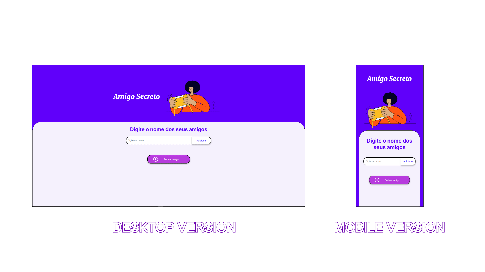

<div align="left" style="position: relative;">
<h1>SORTEADOR DE AMIGO SECRETO</h1>

---
## 💻 Preview
 </br>
 


---

## 🔗 Table of Contents


- [💻 Preview](#-preview)
- [📍 Overview](#-overview)
- [👾 Features](#-features)
- [📁 Project Structure](#-project-structure)
  - [📂 Project Index](#-project-index)
- [🚀 Getting Started](#-getting-started)
- [🔰 Contributing](#-contributing)
- [🎗 License](#-license)
- [🙌 Acknowledgments](#-acknowledgments)

---

## 📍 Overview

SecretFriend simplifies organizing Secret Santa gift exchanges by managing friend lists and facilitating random recipient selection. Users can add friends, ensure no duplicates, and easily draw names. Ideal for groups wanting a fun and fair way to exchange gifts without the hassle. Enjoy a stress-free holiday tradition with SecretFriend.

---

## 👾 Features

|      | Feature         | Summary       |
| :--- | :---:           | :---          |
| ⚙️  | **Architecture**  | <ul><li>Follows a **MVC** design pattern for separation of concerns</li><li>Utilizes **JavaScript** for front-end logic and **HTML/CSS** for UI</li><li>Ensures **scalability** by organizing code into modules and components</li></ul> |
| 🔩 | **Code Quality**  | <ul><li>Consistent **coding style** and **naming conventions** throughout the project</li><li>**Modular** structure promotes code reusability and maintainability</li><li>**Linting** tools used to enforce code quality standards</li></ul> |
| 📄 | **Documentation** | <ul><li>**JavaScript** primary language with clear inline comments for code understanding</li><li>**HTML/CSS** files include descriptive comments for structure and styling</li><li>**README** file provides overview and setup instructions</li></ul> |
| 🔌 | **Integrations**  | <ul><li>**No external integrations** currently identified</li><li>**Potential integration** with backend services for data persistence</li><li>**Testing frameworks** integration for automated testing</li></ul> |
| 🧩 | **Modularity**    | <ul><li>**Separation of concerns** between front-end logic, UI, and data management</li><li>**Reusable components** for friend management and recipient selection</li><li>**Encapsulation** of functionality within modules for easy maintenance</li></ul> |
| 🧪 | **Testing**       | <ul><li>**Unit tests** for critical functions like friend addition and recipient selection</li><li>**Integration tests** for end-to-end functionality validation</li><li>**Test coverage reports** to ensure code reliability</li></ul> |
| ⚡️  | **Performance**   | <ul><li>**Efficient algorithms** for random recipient selection to ensure quick response times</li><li>**Optimized UI rendering** for smooth user experience</li><li>**Minimized network requests** for improved performance</li></ul> |
| 🛡️ | **Security**      | <ul><li>**Input validation** to prevent injection attacks and ensure data integrity</li><li>**Secure coding practices** to mitigate common vulnerabilities</li><li>**HTTPS** implementation for secure data transmission</li></ul> |
| 📦 | **Dependencies**  | <ul><li>**CSS**, **JavaScript**, and **HTML** dependencies for front-end development</li><li>**No external package managers** currently utilized</li><li>**Minimal dependencies** to reduce potential vulnerabilities</li></ul> |

---

## 📁 Project Structure

```sh
└── SecretFriend/
    └── challenge-amigo-secreto_pt-main
        ├── README.md
        ├── app.js
        ├── assets
        ├── index.html
        └── style.css
```


### 📂 Project Index
<details open>
	<summary><b><code>SECRETFRIEND/</code></b></summary>
	<details> <!-- __root__ Submodule -->
		<summary><b>__root__</b></summary>
		<blockquote>
			<table>
			</table>
		</blockquote>
	</details>
	<details> <!-- challenge-amigo-secreto_pt-main Submodule -->
		<summary><b>challenge-amigo-secreto_pt-main</b></summary>
		<blockquote>
			<table>
			<tr>
				<td><b><a href='https://github.com/cauasantoslt/SecretFriend/blob/master/challenge-amigo-secreto_pt-main/app.js'>app.js</a></b></td>
				<td>- Manages a list of friends for a Secret Santa gift exchange, allowing users to add friends and randomly select a recipient<br>- The code ensures no duplicate names are added and prompts users to input names before initiating the selection process.</td>
			</tr>
			<tr>
				<td><b><a href='https://github.com/cauasantoslt/SecretFriend/blob/master/challenge-amigo-secreto_pt-main/style.css'>style.css</a></b></td>
				<td>Defines global styling variables and sets up the overall layout for the project's web interface, ensuring a cohesive design language and consistent user experience.</td>
			</tr>
			<tr>
				<td><b><a href='https://github.com/cauasantoslt/SecretFriend/blob/master/challenge-amigo-secreto_pt-main/index.html'>index.html</a></b></td>
				<td>- Implements the front-end structure for an "Amigo Secreto" web application, allowing users to add and draw names for a secret friend exchange<br>- The HTML file sets up the layout, input fields, buttons, and script references for the application's functionality.</td>
			</tr>
			</table>
		</blockquote>
	</details>
</details>

---
## 🔰 Contributing

- **💬 [Join the Discussions](https://github.com/cauasantoslt/SecretFriend/discussions)**: Share your insights, provide feedback, or ask questions.
- **🐛 [Report Issues](https://github.com/cauasantoslt/SecretFriend/issues)**: Submit bugs found or log feature requests for the `SecretFriend` project.
- **💡 [Submit Pull Requests](https://github.com/cauasantoslt/SecretFriend/blob/main/CONTRIBUTING.md)**: Review open PRs, and submit your own PRs.

<details closed>
<summary>Contributing Guidelines</summary>

1. **Fork the Repository**: Start by forking the project repository to your github account.
2. **Clone Locally**: Clone the forked repository to your local machine using a git client.
   ```sh
   git clone https://github.com/cauasantoslt/SecretFriend
   ```
3. **Create a New Branch**: Always work on a new branch, giving it a descriptive name.
   ```sh
   git checkout -b new-feature-x
   ```
4. **Make Your Changes**: Develop and test your changes locally.
5. **Commit Your Changes**: Commit with a clear message describing your updates.
   ```sh
   git commit -m 'Implemented new feature x.'
   ```
6. **Push to github**: Push the changes to your forked repository.
   ```sh
   git push origin new-feature-x
   ```
7. **Submit a Pull Request**: Create a PR against the original project repository. Clearly describe the changes and their motivations.
8. **Review**: Once your PR is reviewed and approved, it will be merged into the main branch. Congratulations on your contribution!
</details>

<details closed>
<summary>Contributor Graph</summary>
<br>
<p align="left">
   <a href="https://github.com{/cauasantoslt/SecretFriend/}graphs/contributors">
      
   </a>
</p>
</details>

---

## 🎗 License

This project is protected under the [SELECT-A-LICENSE](https://choosealicense.com/licenses) License. For more details, refer to the [LICENSE](https://choosealicense.com/licenses/) file.

---

## 🙌 Acknowledgments

- Thank you all for your support. I hope you like it :-).

---
